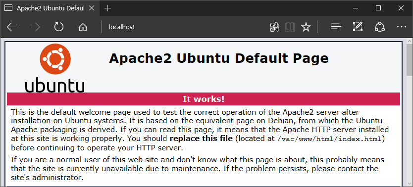

Windows10 の Anniversary Update で Ubuntu が Windows10 で動くようになりました。

仮想化とか抜きで Linux？
な……何を言っているか わからねーと思うｇ
（よく考えたらついこの前まで Interix 動いてたので、言うほど驚くことではないね）

これは早速 LAMP 開発環境に仕立て上げねば、ということで、やってみました。

## ■下準備

初期設定は[だいたいこの辺のパクリ](http://qiita.com/Aruneko/items/c79810b0b015bebf30bb)  
bash のインストールが終わるところまでは、↑と完全に一致なので省略。

**[■sudo の警告対策**](http://qiita.com/ogomr/items/89e19829eb8cc08fcebb)

### 〇 ホスト名を localhost に紐づけ

```sh
$ sudo sh -c 'echo 127.0.1.1 $(hostname) >> /etc/hosts'
```

## ■とりまシステムを最新にする

### 〇 apt-get のリポジトリを国内サーバへ切り替えてアプデ高速化

```sh
$ sudo sed -i -e 's%http://.*.ubuntu.com%http://ftp.jaist.ac.jp/pub/Linux%g' /etc/apt/sources.list
```

### 〇 とりまシステムを最新にする

```sh
$ sudo apt update
$ sudo apt -y full-upgrade
$ sudo apt-get -y autoremove
```

Ubuntu16にアップグレードするにはこれだけではできません。
[追加の手続きが要ります](http://qiita.com/Aruneko/items/2670f42d36a7508c13bb)

ただし procps が一式機能しなくなったりとか、現状ロクなことにならないので人柱上等な方だけどうぞ。

## ■必要最低限のツール類をインストール

### 〇 汽車走らせないと気が済まない方へ

```sh
$ sudo apt-get -y install sl
$ sl
```

### 〇 vim(Full版)は常用するので入れとけ、それと git も使うのでまあ入れとこう

```sh
$ sudo apt-get -y install vim-nox git
```

〇 landscape はいらないので捨てる

```sh
$ sudo apt-get -y purge landscape-client landscape-common
```

## ■sudo でパスワードいちいち聞かれるのうざいので止める

### 〇 wheel グループを作り、自分自身を所属させる

```sh
$ sudo addgroup wheel
$ sudo usermod -aG wheel ユーザー名
```

### 〇 wheel グループに属する人だけ root になれる

```sh
$ sudo vim /etc/pam.d/su
```

```
# Uncomment this if you want wheel members to be able to
# su without a password.
# auth       sufficient pam_wheel.so trust
auth       sufficient pam_wheel.so trust group=wheel
```

↑ この最後の 1 行を挿入

### 〇 wheel グループに所属するユーザは sudo で顔パスできるようにする

```sh
$ sudo visudo
```

```
# Same thing without a password
%wheel ALL=(ALL) NOPASSWD:ALL
```

↑ 末尾に挿入

// visudo なのに、nano が起動してしまう、七不思議の一つなの……

## ■スタートアップ・シャットダウンのスクリプトを入れる

Ubuntu on Windows では rcX.d のスクリプトは自動で動いてくれません。
LAMP 環境構築するにあたり、これでは辛いので自動で動かす処理を仕込みます。
ちょっと長いのでKIAIで。

### 〇 起動スクリプトを書く

[Ubuntu on Windows 用 /etc/rcX.d/ 配下のスクリプトをまとめて叩くスクリプト - GitHub Gist](https://gist.github.com/danmaq/8825128e199c787b46ca61e4786447a8)  
↑即興でスクリプト書いたので、このファイルをカレントフォルダに作ってください。

### 〇 作ったファイルを移動する

```sh
$ chmod 700 rund4wsl.sh
$ sudo chown root:root rund4wsl.sh
$ sudo mv rund4wsl.sh /usr/local/sbin/rund4wsl
```

### 〇 試してみよう

``` sh
$ sudo rund4wsl -l 0 -o stop
```

bash がシャットダウンされたら成功。

ちなみに -l オプションはランレベル、-o オプションは各スクリプトへ丸投げするコマンドです。  
スタートアップ時は -l 3 -o start、シャットダウン時は -l 0 -o stop と指定します。

(ここからは Windows 側での作業)

### 〇 スクリプトを Windows 側から呼び出すスクリプトを書く

[Ubuntu on Windows 用 /etc/rcX.d/ 配下のスクリプトをまとめて叩くスクリプト :: GitHub Gist](https://gist.github.com/danmaq/8825128e199c787b46ca61e4786447a8)  
↑のコメントを参照してバッチファイルを作ってください。
置き場は好みですが、`C:/Users/[ユーザー名]/` 直下に bin フォルダ作って、そこに放り込むのが行儀良さげかも。

### 〇 呼び出しスクリプトを登録する

[ユーザーごとのローカルグループポリシー(セキュリティポリシー)を設定する :: 俺的備忘録 〜なんかいろいろ〜 ](https://orebibou.com/2015/03/%E3%83%A6%E3%83%BC%E3%82%B6%E3%83%BC%E3%81%94%E3%81%A8%E3%81%AE%E3%83%AD%E3%83%BC%E3%82%AB%E3%83%AB%E3%82%B0%E3%83%AB%E3%83%BC%E3%83%97%E3%83%9D%E3%83%AA%E3%82%B7%E3%83%BC%E3%82%BB%E3%82%AD%E3%83%A5/)  
↑を参考に、自分のユーザー名でグループ ポリシー オブジェクト エディターを開きます。

`/コンソール ルート/ローカル コンピューター\\[ユーザー名] ポリシー/ユーザーの構成/Windows の設定/スクリプト(ログオン/ログオフ)` のフォルダを開きます。  
ログオン スクリプトとログオフ スクリプトにそれぞれ登録してあげます。

### 〇 動作確認

Windows を再ログオンしてから、bash を起動します。  
(再びここから bash 側での作業)

```sh
$ ps x | grep rund4wsl
```

↑で grep 以外にも該当するやつがいたら成功です。

## ■LAMP 構築する

Apache・MariaDB(MySQL)・PHPを入れます。
Ubuntu 14 の標準でインストールできる php が 5.5.9 と型落ちモデルなので 7.1 にしてしまいましょう。
[工程の大半がほとんどこの辺のパクリです。](http://qiita.com/walrein/items/b0cc229619ac78852898)

```sh
$ sudo add-apt-repository ppa:ondrej/php
$ sudo apt-get update
$ sudo apt-get -y install mariadb-server libapache2-mod-php7.1
```

インストール途中で mariadb の root ユーザーパスワード聞かれるので、好きなように設定する

### 〇 リポジトリ追加したのでついでにやる

```sh
    sudo apt -y full-upgrade
    sudo apt-get -y autoremove
```

ここで bash を抜けて Windows を再ログオンして、 MariaDB と Apache を起動します。  
Edge で http://localhost/ を確認します。

  
やったー！Ubuntu を捕まえた！

### 〇 データベースの初期設定をする

```
$ sudo mysql_secure_installation
```

mariadb の root ユーザーパスワード聞かれるので、さっき決めたやつを入れる  
最初の質問だけ n であとは Enter 連打でおｋ これで出来上がり！

PHP もちゃんと入ってるか確認しようね

```sh
$ php -v
```

## ■質疑応答

[ほかにも何かあったら質問ください](https://twitter.com/danmaq)。
